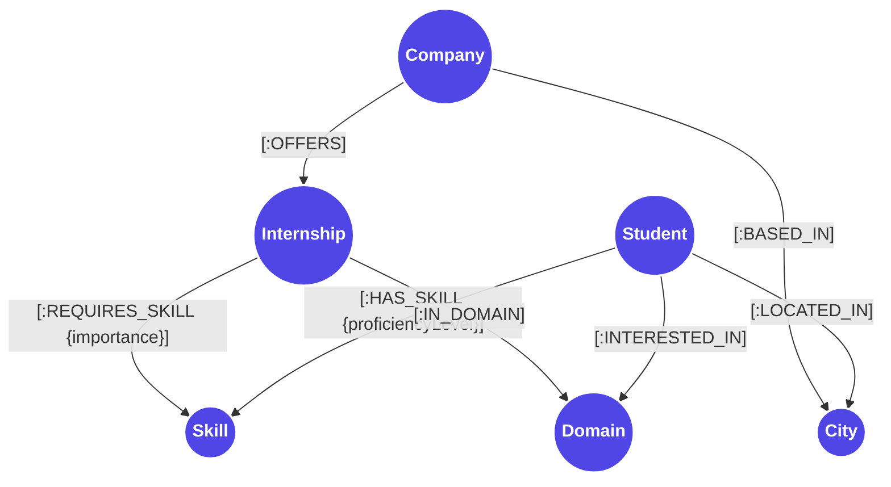

# InternMatch — Graph-Powered Internship Recommendation System

**Live Demo App URL:** https://intern-match-rosy.vercel.app/  
**Video Demonstration:** https://www.loom.com/share/d9a9b88040d44f57ac5826a635325768 
**GitHub Repository:** https://github.com/Demmy-01/Intern-match

---

## Why a Graph Database?

For an internship recommendation system, the relationships between students, their skills, available internships, and required qualifications are just as important as the data itself. In a traditional relational database (SQL), modeling these intricate connections requires numerous bridge tables (e.g., `student_skills`, `internship_skills`, `company_internships`). As the dataset grows and queries become more complex—such as finding an internship that requires a specific set of skills a student possesses, while also filtering by domain and location—SQL databases struggle. They are forced to perform expensive, multi-table `JOIN` operations that degrade performance significantly at scale.

CognoDB, a native graph database, fundamentally solves this problem using **index-free adjacency**. In CognoDB, relationships between nodes are stored as direct memory pointers. A multi-hop traversal—like `(:Student)-[:HAS_SKILL]->(:Skill)<-[:REQUIRES_SKILL]-(:Internship)`—executes in constant time relative to the depth of the subgraph, regardless of the overall size of the database. The engine simply chases pointers from node to node, making deep relationship queries lightning fast.

Furthermore, graph pattern matching makes complex analytical tasks straightforward. Implementing real-time "Skill Gap Analysis" and weighted recommendation scoring in SQL would require convoluted, nested aggregations and subqueries. In Cypher (CognoDB's query language), we can express these complex graph patterns visually and intuitively. We can collect a student's skills, match them against internship requirements, compute weighted match scores based on proficiency and importance, and identify missing skills—all within a single, elegant, and highly performant query.

---

## Graph Data Model

The InternMatch system is built on a highly interconnected graph data model representing the ecosystem of students and internships.



### Nodes & Properties
* **Student**: Represents an applicant (e.g., `id`, `name`, `gpa`).
* **Skill**: Represents a technical or soft skill (e.g., `id`, `name`).
* **Internship**: Represents an available role (e.g., `id`, `title`, `stipend`, `mode`).
* **Company**: Represents an employer (e.g., `id`, `name`, `industry`).
* **Domain**: Represents a broad industry field (e.g., `id`, `name`).
* **City**: Represents a geographic location (e.g., `id`, `name`).

### Relationships & Properties
* `(:Student)-[:HAS_SKILL]->(:Skill)`: Contains `proficiencyLevel` (e.g., Beginner, Intermediate, Advanced).
* `(:Internship)-[:REQUIRES_SKILL]->(:Skill)`: Contains `importance` (e.g., Required, Optional).

---

## Key Cypher Queries Explained

The core of our recommendation engine is powered by a single, highly optimized Cypher query. It performs a multi-hop graph traversal to match a student against all available internships, computing a weighted match score and identifying skill gaps on the fly.

### The Recommendation Query

```cypher
// ── Step 1: Collect the student's entire skill set into a list ─────────
MATCH (student:Student {id: $studentId})-[has:HAS_SKILL]->(sk:Skill)
WITH student,
     collect(sk.id) AS studentSkillIds,
     collect({id: sk.id, name: sk.name, proficiency: has.proficiencyLevel}) AS studentSkillInfos

// ── Step 2: Find every internship and its required skills ──────────────
MATCH (internship:Internship)-[req:REQUIRES_SKILL]->(reqSkill:Skill)
MATCH (company:Company)-[:OFFERS]->(internship)
OPTIONAL MATCH (internship)-[:IN_DOMAIN]->(domain:Domain)

// ── Step 3: For each required skill, check if the student has it ───────
WITH student, studentSkillIds, studentSkillInfos,
     internship, company, domain, reqSkill, req,
     reqSkill.id IN studentSkillIds AS isMatched,
     CASE req.importance WHEN 'Required' THEN 2 ELSE 1 END AS impMult,
     CASE req.importance WHEN 'Required' THEN 6 ELSE 3 END AS maxSkillScore

// ── Step 4: Look up proficiency for matched skills via list comprehension
WITH internship, company, domain, reqSkill, req, isMatched, impMult, maxSkillScore,
     CASE WHEN isMatched THEN
       [info IN studentSkillInfos WHERE info.id = reqSkill.id | info.proficiency][0]
     ELSE null END AS prof

// ── Step 5: Compute per-skill weighted score ───────────────────────────
WITH internship, company, domain, reqSkill, req, isMatched, impMult, maxSkillScore, prof,
     CASE prof
       WHEN 'Advanced'     THEN 3
       WHEN 'Intermediate' THEN 2
       WHEN 'Beginner'     THEN 1
       ELSE 0
     END AS profWeight

// ── Step 6: Aggregate across all skills per internship ─────────────────
WITH internship, company, domain,
     sum(profWeight * impMult)  AS matchScore,
     sum(maxSkillScore)         AS maxPossibleScore,
     [x IN collect(
       CASE WHEN isMatched
         THEN {name: reqSkill.name, proficiency: prof}
         ELSE null END
     ) WHERE x IS NOT NULL]     AS matchedSkills,
     [x IN collect(
       CASE WHEN NOT isMatched
         THEN {name: reqSkill.name, importance: req.importance}
         ELSE null END
     ) WHERE x IS NOT NULL]     AS skillGaps

// ── Step 7: Compute match percentage and apply filters ─────────────────
WITH internship, company, domain,
     matchScore, maxPossibleScore, matchedSkills, skillGaps,
     CASE WHEN maxPossibleScore > 0
          THEN round(toFloat(matchScore) / maxPossibleScore * 100)
          ELSE 0
     END AS matchPercentage

WHERE size(matchedSkills) > 0
  AND ($locationPreference IS NULL OR internship.mode = $locationPreference)
  AND internship.stipend >= $minStipend
  AND size(skillGaps) <= $maxSkillGap

// ── Step 8: Return sorted results ──────────────────────────────────────
RETURN internship.id          AS internshipId,
       internship.title       AS title,
       internship.description AS description,
       internship.mode        AS location,
       internship.stipend     AS stipend,
       internship.duration    AS duration,
       company.name           AS companyName,
       company.industry       AS companyIndustry,
       domain.name            AS domain,
       matchPercentage,
       matchScore,
       matchedSkills,
       skillGaps
ORDER BY matchPercentage DESC, matchScore DESC
```

### How it Works
1. **Parameterized Queries for Security:** Notice the use of `$studentId`, `$locationPreference`, `$minStipend`, and `$maxSkillGap`. These are query parameters passed via the official `neo4j-driver` over the Bolt protocol. This completely prevents Cypher injection attacks, as the database engine treats them strictly as values, never as executable code.
2. **Preventing Cartesian Products:** Instead of using nested `OPTIONAL MATCH` clauses (which can cause row explosions when a student has many skills and an internship requires many skills), the query first collects the student's skills into memory lists (`studentSkillIds` and `studentSkillInfos`).
3. **List Comprehension & Membership:** It then finds all internship requirements and uses standard list-membership checks (`reqSkill.id IN studentSkillIds`) to determine if the student possesses the required skill, effectively performing a highly optimized set intersection.
4. **Weighted Scoring:** The query calculates a `profWeight` based on the student's proficiency level and multiplies it by an `impMult` (Importance Multiplier) ensuring that matching 'Required' skills significantly boosts the score compared to matching 'Optional' skills.
5. **Skill Gap Analysis:** Finally, it uses list comprehensions on the aggregation collections to separate matched skills from missing skills (`skillGaps`), returning everything cleanly to the application layer.

---

## Local Setup & Environment Instructions

### Prerequisites
* Node.js (v18 or higher)
* npm (Node Package Manager)
* An active CognoDB instance (or Neo4j AuraDB instance)

### 1. Provision a Database (CognoDB Cloud)
1. Sign up for a CognoDB Cloud account and provision a free tier (e.g., `c0`) instance.
2. Once provisioned, note down your connection URI (Bolt protocol) and your database credentials.

### 2. Configure Environment Secrets
Create a `.env` file in the root directory of the project and add your database credentials and API port:

```env
COGNODB_URI=bolt+s://<YOUR_COGNODB_HOST>:<PORT>
COGNODB_USER=neo4j
COGNODB_PASSWORD=your_super_secret_password
PORT=5000
```

### 3. Seed the Database
Before running the application, populate your graph database with sample nodes (Students, Skills, Internships, etc.) and relationships. Run the seed script from the root directory:

```bash
node seed.js
```
*(You should see console output indicating the data was successfully loaded).*

### 4. Start the Backend API Server
Start the Express server which connects to CognoDB via the Bolt driver:

```bash
node server.js
```
The backend API will start on `https://localhost:5000/api/students`.

### 5. Run the React Frontend
Open a new terminal window, navigate to the `frontend` directory, install dependencies, and start the Vite development server:

```bash
cd frontend
npm install
npm run dev
```
The application UI will now be accessible at `https://localhost:5173/`.

---

## Architecture & Tech Stack Overview

 **Database:** **CognoDB** — Managed Graph Database utilizing the Bolt 5.0 protocol for high-performance binary communication, accessed via the official `neo4j-driver`.
 **Backend:** **Node.js** with **Express** — A lightweight REST API layer handling request parsing, parameter sanitization, and CORS (`cors`), managed by `dotenv` for secret injection.
 **Frontend:** **React** & **TypeScript** — Bootstrapped with **Vite** for incredibly fast HMR.
 **Styling & UI:** **Tailwind CSS v4** for utility-first responsive styling, featuring a modern SaaS aesthetic, custom SVG branding, and dynamic **DiceBear Avatars**.
 **Icons:** **Lucide React** for crisp, consistent iconography.
